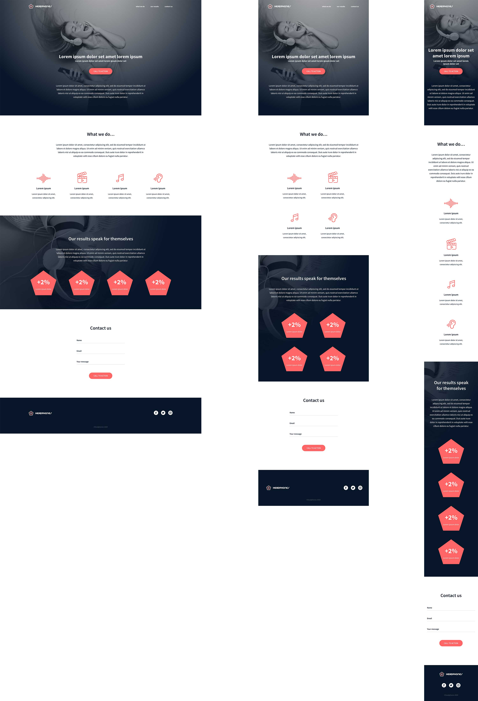

This repository contains 0x09. Implement a design from scratch, taks for
Holberton School. 1/02/2022

In this project, you will implement from scratch, without any library, a web page. You will use all HTML/CSS/Accessibility/Responsive design knowledges that you learned previously.

You won’t have a lot of instruction, you are free to implement it the way that you want - the objective is simple: Have a fully functional web page that looks the same as the designer file.

Here the final result:

## Requirements

- All HTML/CSS code is W3C compliant

## Tasks

<ol>
   <li>0. Read and be familiar with Figma</li>   
   <li>1. Header</li>
   <li>2. "What we do..." section</li>
   <li>3. "Our results" section</li>   
   <li>4. Contact us 
   <li>5. Footer 
</ol>
